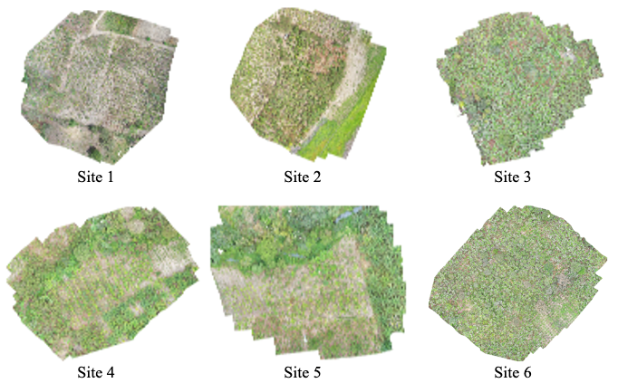

# ReforesTree 🌴

We are excited to share the ReforesTree dataset! 🎉

We introduce the ReforesTree dataset in hopes of encouraging the fellow machine learning community to take on the challenge of developing low-cost, scalable, trustworthy and accurate solutions for monitoring, verification and reporting of tropical reforestation inventory. 

#### This is a dataset for the following 6 agroforestry sites
In alphabetical order
1. _Carlos Vera Arteaga_
2. _Carlos Vera Guevara_
3. _Flora Pluas_
4. _Leonor Aspiazu_
5. _Manuel Macias_
6. _Nestor Macias_

## Dataset Components
For each site the data we publish consists of four components free for use:
1. 🛸 Raw drone RGB images _(see wwf_ecuador)_
2. 🌴 Hand measured tree parameters (diameter at breast height, species, biomass, and location) of every tree _(see field_data.csv)_
3. 🔲 Set of bounding boxes of trees for each site cleaned by hand and labeled as banana or not banana _(see annotations/cleaned)_
4. ↔️ Mappings of these bounding boxes with tree labels based on location _(see mappings/final)_

## Tutorial
In the tutorial you'll find the steps to recreate (and hopefully improve) the dataset and how to use it. 

Please read our paper [here](https://arxiv.org/abs/2201.11192).
For any questions, please reach out to gyri.reiersen@tum.de or david.dao@inf.eth.ch
